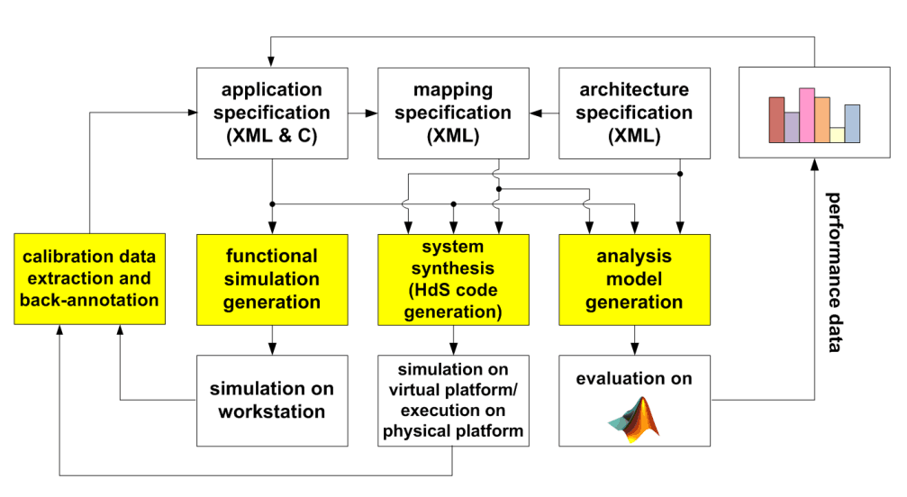
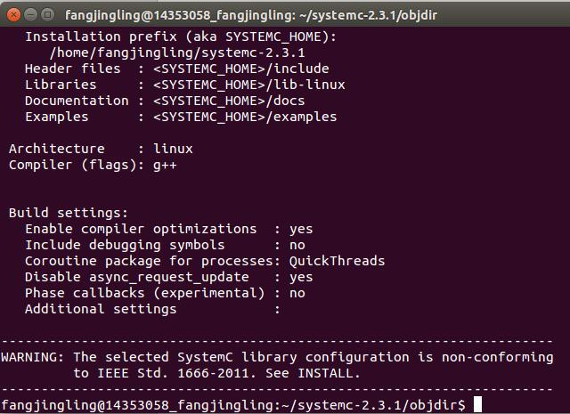
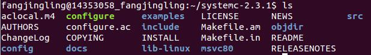
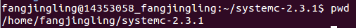
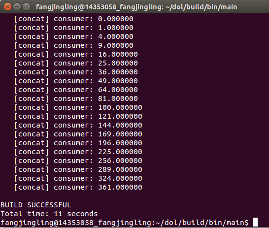

##实验报告 ##
### Description ###
***
DOL(The distributed operation layer)是一个软件开发框架，方便应用的并发运行。DOL允许指定应用程序，使之可以基于Kahn程序网络模型的计算，同时兼具一个基于SystemC的仿真引擎。另外，DOL提供了一个基于xml的规范格式，用来来描述并行应用程序在多处理器系统上的实现，其中包括绑定行和映射。

*** 
### How to install ###
***
####安装一些必要的环境####
* $		sudo apt-get update 
   
* $		sudo apt-get install ant

* $ 	sudo apt-get install openjdk-7-jdk

* $		sudo apt-get install unzip

####下载文件####

* sudo wget http://www.accellera.org/images/downloads/standards/systemc/systemc-2.3.1.tgz
* sudo wget http://www.tik.ee.ethz.ch/~shapes/downloads/dol_ethz.zip

####解压文件####
* 新建dol文件夹，执行下面语句：$	mkdir dol
* 将dolethz.zip解压到dol文件夹中：
    $	  unzip dol_ethz.zip -d dol
* 解压systemc：$	tar -zxvf systemc-2.3.1.tgz

####编译systemc####
* 解压进入systemc-2.3.1的目录下：$	cd systemc-2.3.1
* 新建一个临时文件夹objdir：  $	mkdir objdir
* 进入该文件夹objdir：$	cd objdir
* 运行configure： $	../configure CXX=g++ --disable-async-updates
#####运行后的结果：#####

* 编译：$	sudo make install
* $ cd .. $ ls
#####编译完成后文件目录如下：#####

* 执行：$	pwd，记录下当前的工作路径，结果如下：

####编译dol####

* 进入刚刚的dol文件夹：$	cd ../dol
* 修改build_zip.xml文件

property name="systemc.inc" value="YYY/include"

property name="systemc.lib" value="YYY/lib-linux/libsystemc.a"

把YYY改成上页pwd的结果

* 编译：$	ant -f build_zip.xml all
显示build successful

* 进入build/bin/mian路径下：$	cd build/bin/main
* 运行：$	sudo ant -f runexample.xml -Dnumber=1

#####运行结果如下：#####

***

### Experimental experience ###

***

在本次实验中遇到了很多问题。首先是网络的连接问题。一开始并没有意识到在环境配置过程中是需要连接网络的，所有在“安装一些必要的环境”的第一步就出现了错误。上网搜了很多解决的方法，但是都没成功。后来发现电脑虚拟机服务项那里并没有启动，设置一下就好了。

跟着PPT一步一步做下去，在编译systemc那一部分又遇到了问题。在编译完“sudo make install”之后，文件目录那里的显示明显不对，后来发现是指令输入有误。

在最后编译dol的时候又遇到了问题，前面都貌似没问题，在最后运行第一个例子ant -f runexample.xml -Dnumber=1时就有不少错误了。第一个错误是在输入指令的时候没有输入sudo。然后显示一直找不到有文件找不到。这个显然是我们上面修改路径那一部分的问题。修改了好久都没改好。后来发现我在做的过程中犯了一个错误，就是在配置的过程中一遇到进入文件夹不同的情况我就会重新开一个终端，其实我们利用cd..就可以了。这样的结果显示我得到的路径本身就是错误的。做了修改之后发现还是找不到文件，最后的问题是在修改YYY的时候由于换行问题多了一个空格。以后多注意这些方面的问题。

***
