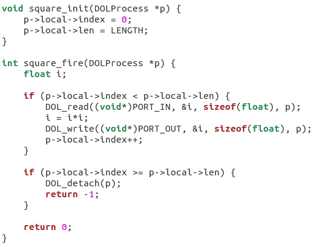
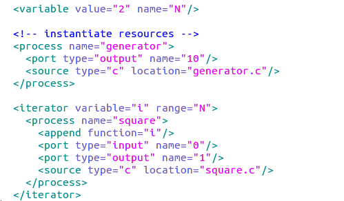
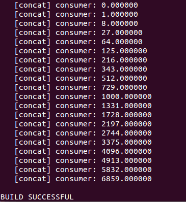
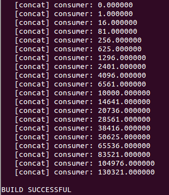
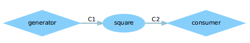
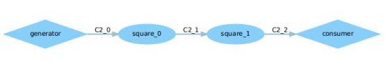

## Lab3-DOL实例分析&编程 ##

### Description ###
***
DOL(The distributed operation layer)是一个软件开发框架，方便应用的并发运行。DOL允许指定应用程序，使之可以基于Kahn程序网络模型的计算，同时兼具一个基于SystemC的仿真引擎。另外，DOL提供了一个基于xml的规范格式，用来来描述并行应用程序在多处理器系统上的实现，其中包括绑定行和映射。

***
### 具体修改的解释 ###
***

* **example1**
- ***首先看到square文件。***
	
- ***读square的端口"PORT_IN",将值读到i，然后i做了平方，再将值存在i中，然后把新得到的i值写到端口，重复length次就好了。所以这里如果我们要做三次方，只需再乘以i即可。修改后的代码如下：***

	
* **example2**
* ***将value的值从3改为2，修改完之后在下面的iterator的N值就变成了2，执行平方的次数就变成了2,3个square模块就变成了2个。***

***

### 运行结果 ###
***
* **输入指令：**

		sudo ant -f runexample.xml -Dnumber=1 

		sudo ant -f runexample.xml -Dnumber=2

***

### dot图 ###
***
**example1**

* 
**example2**
* 
***

### Experimental experience ###

***

在这次实验中，修改完在运行的时候总是遇到问题。一开始一直出现原来的结果，这里是因为修改完之后没有重新生成build文件。因为我们之前实验已经生成了这个文件，这里必须先删掉，具体步骤见实验1。

还有一个问题是在修改example1的时候，提示修改square.c文件，这里要注意不要打开了example2的square.c文件。一开始就是因为修改错了，一直是错误的结果。

***
