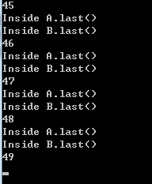

## Lab4-死锁 ##

### Description ###
***

* **死锁就是两个或者多个进程，互相请求对方占有的资源。满足一下四个条件：**
 * 互斥条件：一个资源每次只能被一个进程使用
 * 请求与保持条件：一个进程因请求资源而阻塞时，对已获得的资源保持不放
 * 不剥夺条件:进程已获得的资源，在末使用完之前，不能强行剥夺
 * 循环等待条件:若干进程之间形成一种头尾相接的循环等待资源关系
* **关键字 synchronized:**
 * 当它用来修饰一个方法或者一个代码块的时候，能够保证在同一时刻最多只有一个线程执行该段代码。
 * 当一个线程访问object的一个synchronized同步代码块或同步方法时，其他线程对object中所有其它synchronized同步代码块或同步方法的访问将被阻塞。

***
### 问题阐述 ###
***
####死锁停在第几次的截图####
* **代码如下：**

* **在命令行里输入：**

		javac Deadlock.java
		java Deadlock

* 

* **让这个程序跑一百遍，通常情况下，跑个几十遍就会停。停在多少次是随机的，调节程序中count值，使其发生死锁。这里死锁停在第49次。**

####产生死锁的4个必要条件####
 * 互斥条件：一个资源每次只能被一个进程使用
 * 请求与保持条件：一个进程因请求资源而阻塞时，对已获得的资源保持不放
 * 不剥夺条件:进程已获得的资源，在末使用完之前，不能强行剥夺
 * 循环等待条件:若干进程之间形成一种头尾相接的循环等待资源关系
####对上述程序产生死锁的解释####
runnable是一个是一个线程，会在后台默默运行。每次调度到它时，它就会运行run（）里面的语句。当运行t.start(),之后，线程t就被插入到调度队列里，然后主线程等待20000，之后执行a对象的methodA方法，在执行过程中，主线程的时间片用完之后，CPU则会调度子线程，子线程执行b对象的methodB方法，这里面又调用了a的last方法，而这个代码块中包含synchronized，主线程有methodA的锁，所以子线程会被阻塞，等待主线程释放资源，而主线程也在等待子线程的资源，这个时候就出现了死锁。 

### Experimental experience ###

***

这次实验因为已经给了代码，主要做的就是一个了解和分析的过程。我们首先要了解什么是死锁，并且掌握死锁发生的四个条件，然后学会从代码的角度去分析是否发生死锁。

***
