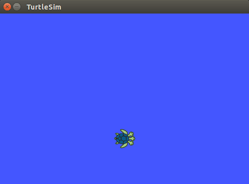
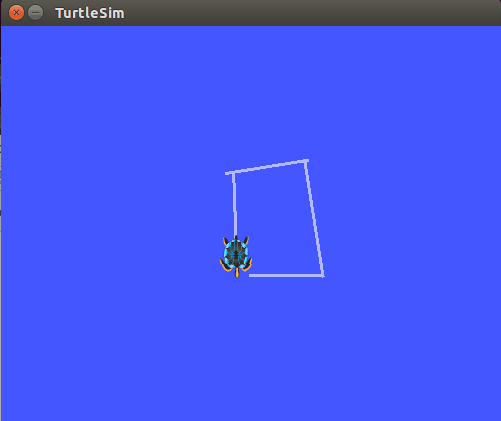
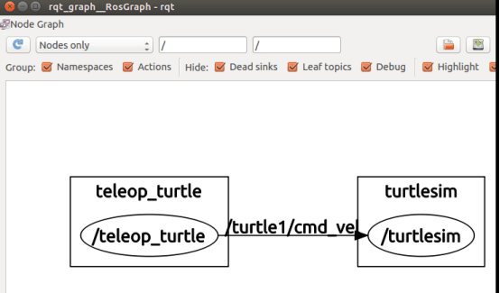

## Lab5-安装ROS ##

### Description ###
***
ROS是开源的，是用于机器人的一种后操作系统，或者说次级操作系统。它提供类似操作系统所提供的功能，包含硬件抽象描述、底层驱动程序管理、共用功能的执行、程序间的消息传递、程序发行包管理，它也提供一些工具程序和库用于获取、建立、编写和运行多机整合的程序。

***
### ROS配置 ###
***
* **添加source.list**
* sudo sh -c 'echo "deb http://packages.ros.org/ros/ubuntu $(lsb_release -sc)
main" > /etc/apt/sources.list.d/ros-latest.list'

* **添加keys,指令如下：**
- sudo apt-key adv --keyserver hkp://pool.sks-keyservers.net --recv-key
0xB01FA116

* **安装**
* **确保虚拟机的软件包索引是最新的：**
* sudo apt-get update

* **桌面完整版安装**
* sudo apt-get install ros-jade-desktop-full

* **初始化rosdep:**
* sudo rosdep init
* rosdep update

* **环境配置**
* echo "source /opt/ros/jade/setup.bash" >> ~/.bashrc
source ~/.bashrc

* **安装rosinatall**
* sudo apt-get install python-rosinstall

***

### 测试ROS ###

***

* **打开一个终端，输入指令：**
* roscore
* **打开第二个终端，输入以下指令，开启小乌龟界面：**
* rosrun turtlesim turtlesim_node
* **注：这里要始终保持第一个终端运行**

* **打开第三个终端，输入以下指令，接收键盘输入，按下键盘上下左右,控制小乌龟移动**
* rosrun turtlesim turtle_teleop_key

* **打开第四个终端，输入指令，可以看到ROS nodes以及Topic等图形展示：**
* rosrun rqt_graph rqt_graph

* **关掉小乌龟运动的那个终端。**
 

***

### Experimental experience ###

***

这次实验时安装配置实验。在安装过程中跟着文档一步步进行，几乎没遇到什么问题，这里要注意的是要保持网络是可用的。问题主要出在了测试这一块，因为并不知道怎么进行，是问了别人才知道的。

***
